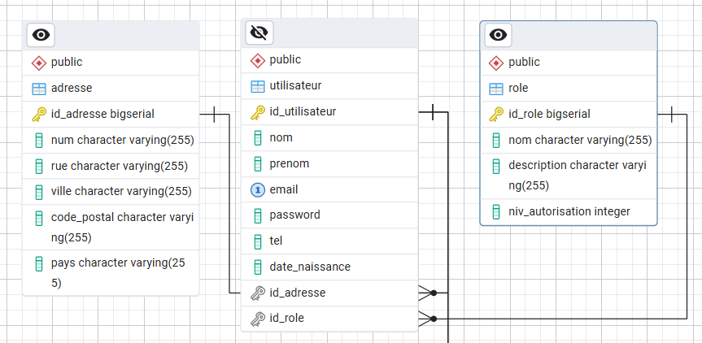

# Gestion de réservations de chambres et de salles

## Description
Application d'hôtellerie centrée sur la gestion des utilisateurs, rôles (client, admin) et adresses. Authentification sécurisée via JWT.

---

## Fonctionnalités
- Gestion des utilisateurs (CRUD)
- Gestion des rôles et adresses
- Authentification JWT
- Tests unitaires et d’intégration

---

## Technologies
- Java 22 / Spring Boot
- Spring Security, JWT
- Spring Data JPA
- Base de données AlwaysData
- Maven, JUnit 5, Mockito

---

## Base de données
- URL : `jdbc:postgresql://postgresql-gestion-chambres-salles.alwaysdata.net:5432/gestion-chambres-salles_bdd`
- Utilisateur : `gestion-chambres-salles`
- Mot de passe : `Yq4ye!K7RjSxK4S`

---

## Lancement
1. Cloner le projet et passer sur la branche :
```bash
git clone https://github.com/Kronos131-dev/Gestion-de-reservations-de-chambres-et-de-salles.git
cd Gestion-de-reservations-de-chambres-et-de-salles
git checkout Users_and_roles_management
```
2. Lancer l'application :
```bash
mvn spring-boot:run
```
### Accès à l'application
- Page de login : [http://localhost:8080/login](http://localhost:8080/login)
- Page de gestion des utilisateurs : [http://localhost:8080/user](http://localhost:8080/users)
- Page du Swagger : [http://localhost:8080/swagger-ui/index.html](http://localhost:8080/swagger-ui/index.html)
### Comptes de test
| Rôle  | Email           | Mot de passe |
|-------|-----------------|--------------|
| Admin | admin@test.com  | admin123     |
| Client| client@test.com | client123    |

### Tests
Les tests unitaires et d’intégration se trouvent dans `src/test/java`.  
Pour les exécuter :

```bash
mvn test
```

### MCD

