# Gestion des Tarifs – Application Web JEE

## Auteurs

* **HANNACHI Rym**
* **BENKIRANE Yassir**

---


Le projet **Gestion des Tarifs** est une application Web JEE complète développée avec **Spring Boot** selon une **architecture N-Tiers**.

L’objectif principal est de gérer la **tarification hôtelière** (séjours, espaces, services extras et prestations) de manière fiable et évolutive.
Le projet applique les notions : **ACID, SOLID, DTO, Mapper, Transactions, Tests unitaires et d’intégration**.

---

## Architecture et Choix Techniques

Nous avons opté pour une architecture N-Tiers pour garantir la maintenance et l'évolution du code.

### Architecture N-Tiers
Le projet est structuré en trois couches distinctes, afin d’assurer une séparation claire des responsabilités.
* **persistance** : Gestion de l'accès aux données (JPA, Repository, Entités).
* **business** : Services (Logique métier et règles de calcul tarifaire), DTOs, Mappers et Validations.
* **presentation** : Contrôleurs, Vues Thymeleaf, Gestion des erreurs et Ressources statiques.

---

## Concepts Techniques Implémentés

* **DTO Pattern** : Isolation totale entre la base de données et la couche présentation.
* **Mapper Pattern** : Conversion bidirectionnelle DTO et Entity.
* **Spring IoC & DI** : Injection de dépendances via `@Service`, Contrôleur et `@Autowired`.
* **Transactions ACID** : Sécurisation des traitements critiques avec `@Transactional`.
* **Validation Jakarta** : Sécurisation des entrées utilisateurs (`@NotNull`, `@Min`, `@Size`, etc.).
* **Gestion des Exceptions** : Exceptions métier centralisées et messages utilisateurs clairs.
---

## Galerie de l'Application

Nous avons développé une interface ergonomique respectant cette **charte graphique**.

### 1. Identité Visuelle
*Définition des couleurs et de la typographie utilisées dans tout le projet.*

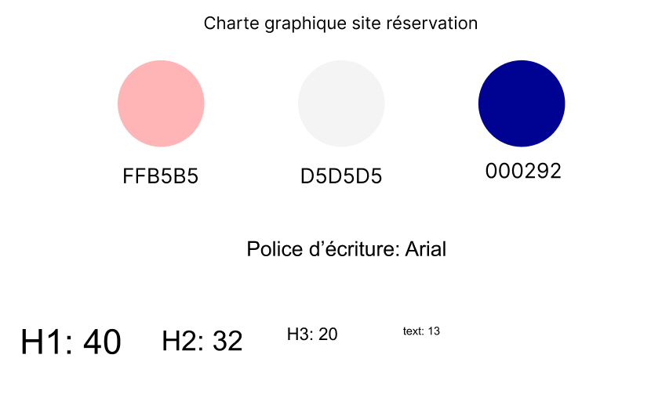

### 2. Gestion des Tarifs (Prestations)
*Vue d'ensemble des prestations avec indicateurs visuels de paiement.*
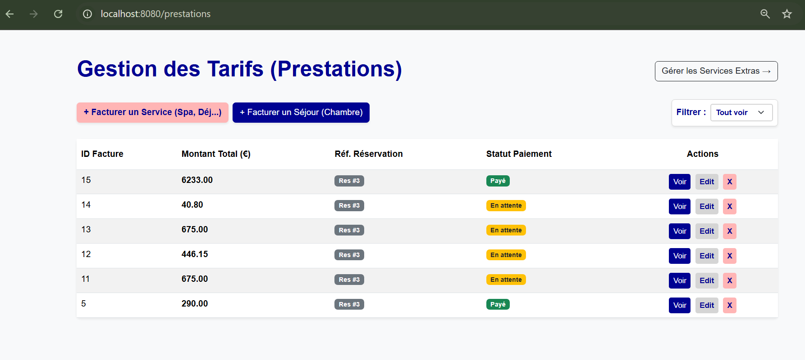

*Filtrage dynamique par statut (Payé / En attente) sans rechargement de page.*
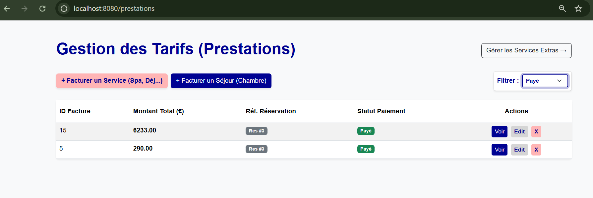
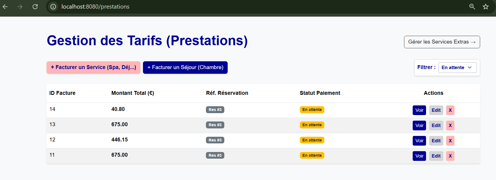

### 3. Détails et Prestations
*Calcul automatique du prix d'un séjour selon la formule : (Prix Chambre × Coeff Saison × Nuits).*
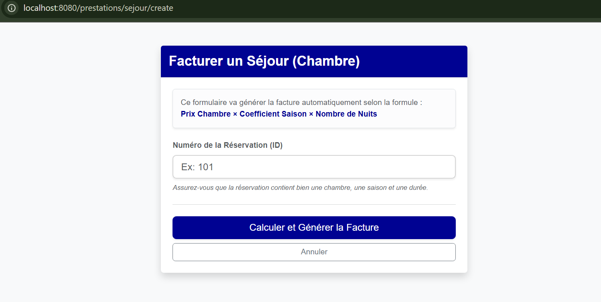

*Fiche détaillée d'une prestation.*
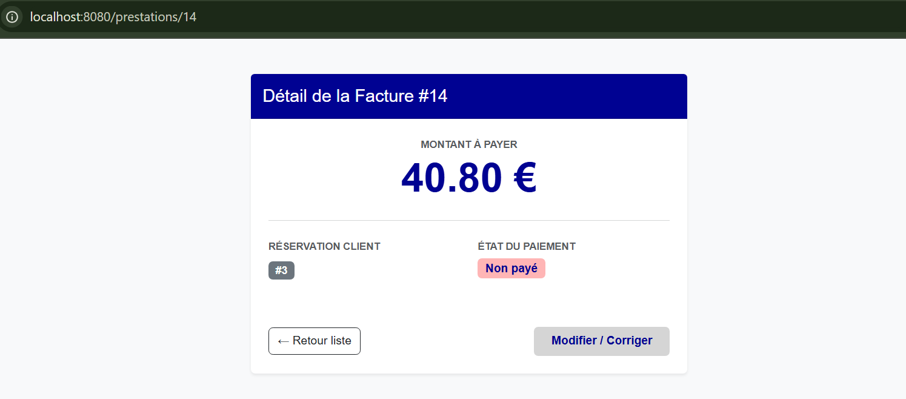
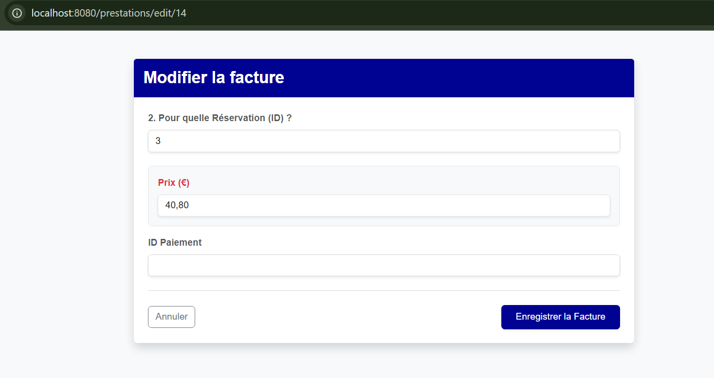

### 4. Services Extras
*Catalogue des services (Petit-déjeuner, Spa, etc.) avec recherche instantanée.*
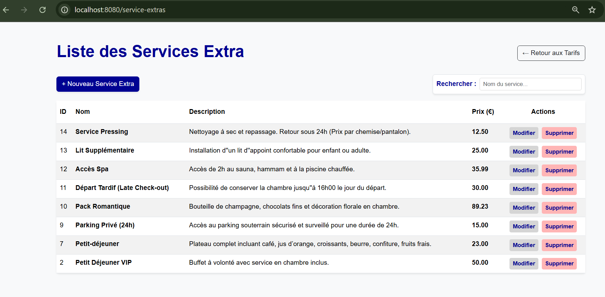

*Recherche en temps réel (ex: "pa" pour Parking).*
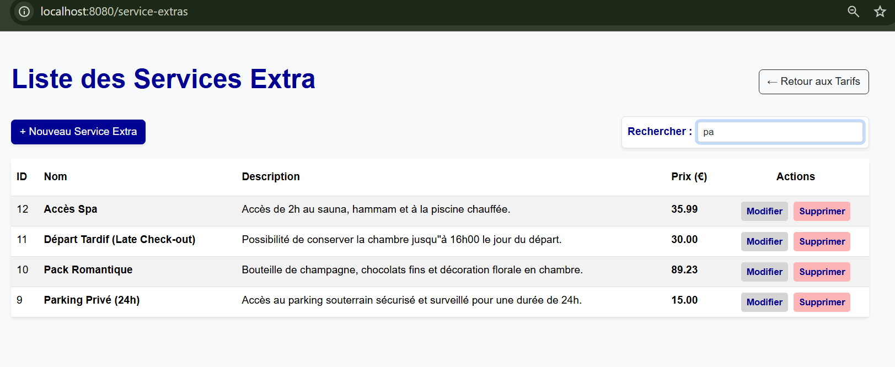

*Formulaires de création et d'édition.*
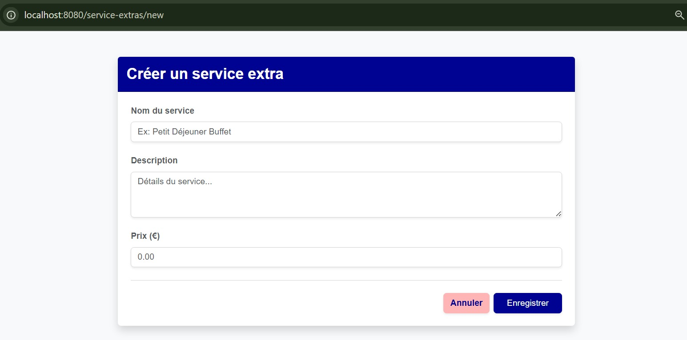
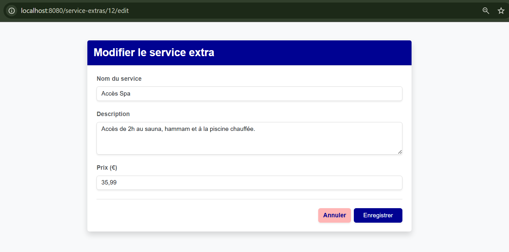

---

## Installation et Configuration
### Configuration de la base de données
Avant d’exécuter l’application, veillez à *définir les variables d’environnement* suivantes pour permettre la connexion à la base de données PostgreSQL :
DB_URL, DB_USERNAME et DB_PASSWORD

### Prérequis
* Java 17+
* Maven
* PostgreSQL

---

## Tests

* **Tests Unitaires (JUnit 5 & Mockito)**
  Validation isolée de la couche Business (Services) en mockant les Repositories.
* **Tests d’Intégration**
  Vérification des flux complets depuis le Contrôleur jusqu'à la base de données (H2 In-Memory).

### Lancement du Projet

```bash
mvn clean install
mvn spring-boot:run
```

---
